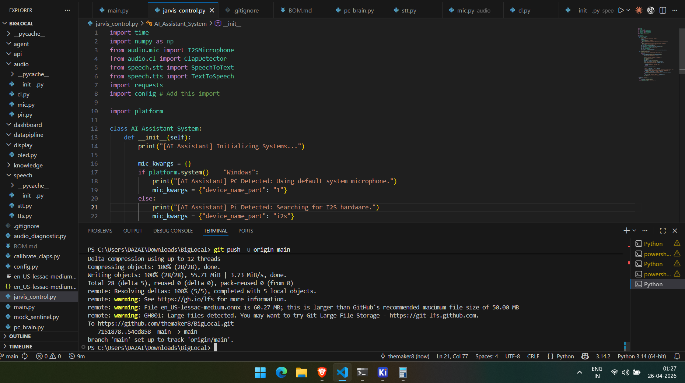
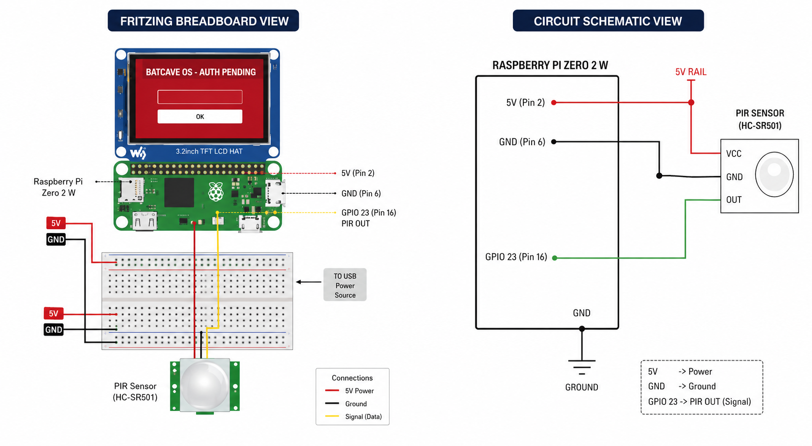

# BigLocal

An AI autonomous agent which have access to physical hardware somewhat giving AI an hardware and sensors to control things.Like J.A.R.V.I.S

# Working And Design
## 1.The core brain

• Environment: A sandboxed Linux Virtual Machine (VM) on a host laptop.

• Logic: Runs the AI agent and the OpenClaw framework.

• Interface: Integrated with Telegram for remote monitoring and command input.

• Security: The VM isolation prevents the AI or automation scripts from accessing the host's primary file system.

## 2. Hardware Node(Raspberry Pi)

• Detection: The PIR sensor monitors your workspace. The system remains in "Stealth Mode" until you are physically present.

• Trigger: When you walk in, the  screen wakes up and displays the current status of your Local AI (e.g., "Brain Idle" or "Analyzing File").

• Execution: You tap the Pi’s screen Pi sends an "Authenticated" signal back to the VM. The VM executes the OpenClaw command.

# Remaining setup once project is done

I utilized a Virtual Machine to isolate the AI's execution environment. This ensures that even if the AI agent or OpenClaw framework is compromised, it cannot access the host machine's primary OS. The Pi Zero acts as the hardware firewall for this isolated 'Big' brain."

I would install more sensor and other modules to make it even more next level.

# BOM

| Name                         | Purpose                                                                 | Quantity | Price (USD) | Link | Distributor |
|------------------------------|-------------------------------------------------------------------------|----------|------------|------|------------|
| Power Adapter                | A secure power adapter suited for Raspberry Pi                         | 1        | 2.01       | https://robu.in/product/standard-5v-3a-power-supply-with-l-style-micro-usb-plug | Robu       |
| Micro SD Card                | For loading in Raspberry Pi                                            | 1        | 11.66      | https://robu.in/product/sandisk-ultra-micro-sd-16gb-uhs-i-98mbs-r-class-10-memory-card| Robu       |
| LCD Display                  | Showing the stats                                                      | 1        | 19.98      | https://robu.in/product/3-2-inch-tft-lcd-screen-for-raspberry-pi| Robu       |
| PIR Motion Sensor (HC-SR501) | For sensing motion in the environment                                  | 1        | 0.65       | https://robu.in/product/pir-motion-sensor-detector-module-hc-sr501 | Robu       |
| Raspberry Pi Zero 2 W        | Running the core software and integrating all sensors (main brain)     | 1        | 22.50      | https://robu.in/product/raspberry-pi-zero-2-w-with-header | Robu       |

## Screenshots

