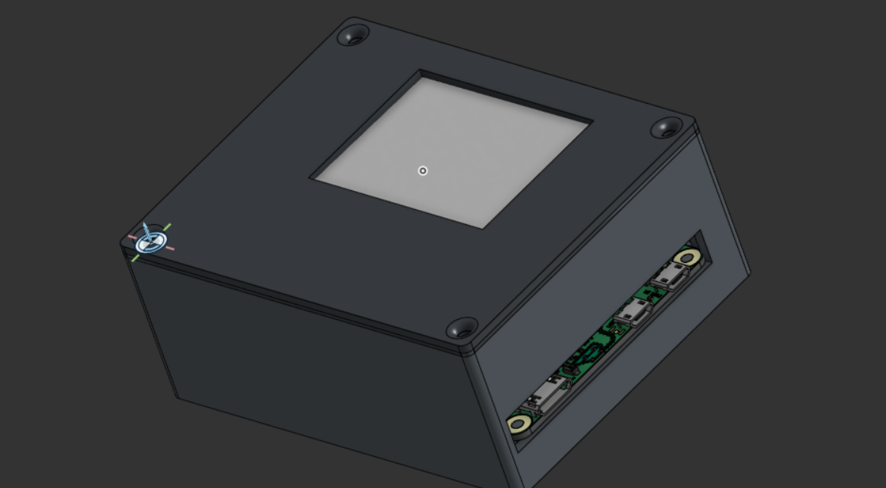
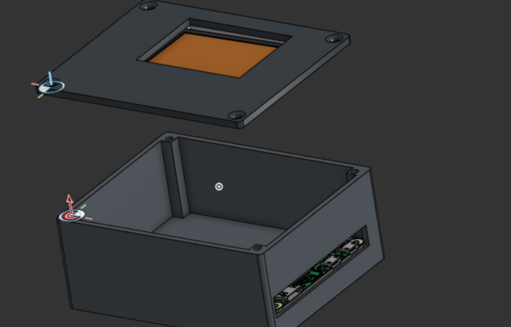
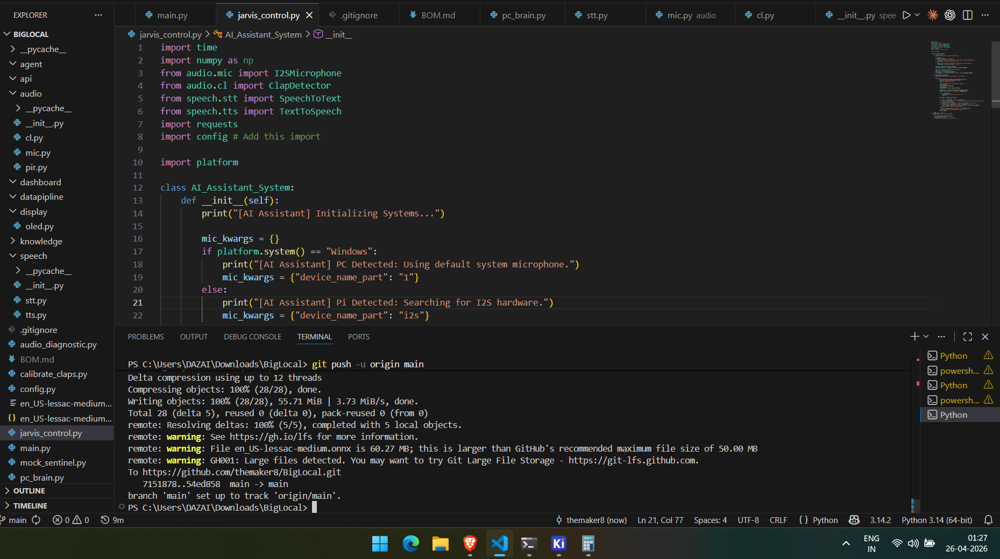
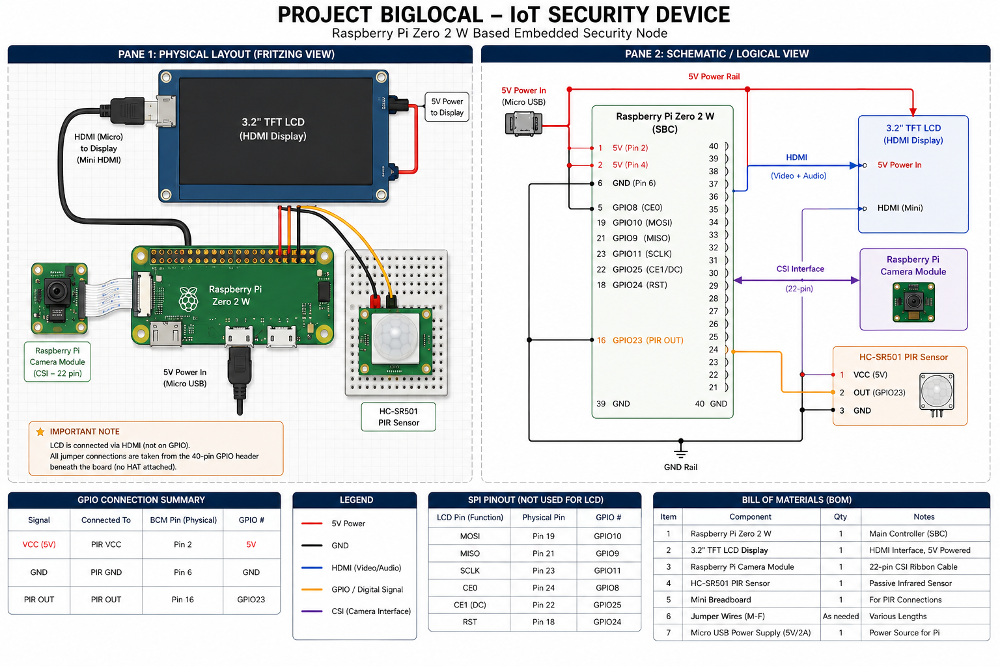
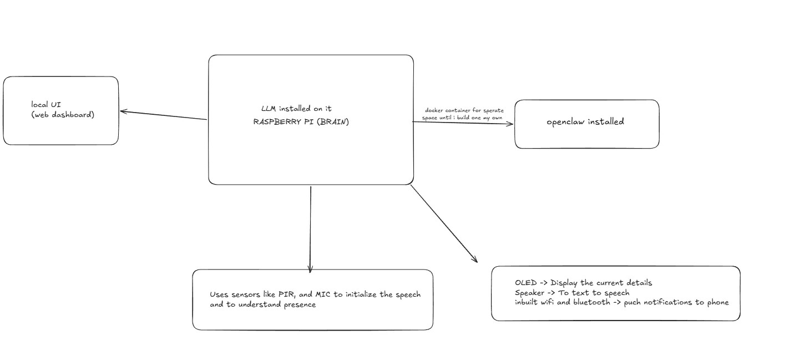

# BigLocal

BigLocal is an AI-driven autonomous system designed to bridge software intelligence with physical hardware. The goal is simple: give an AI agent controlled access to sensors and real-world inputs, while keeping everything private, local, and secure.

Unlike cloud-based assistants, this system runs in a **fully isolated local environment**, ensuring that all data and execution remain under your control. In many ways, it is inspired by systems like J.A.R.V.I.S — but built with practical constraints and real hardware.

---

---

# Working and Design

## 1. Core Brain (Virtual Machine)

* **Environment:** A sandboxed Linux Virtual Machine running on the host laptop
* **Logic:** Executes the AI agent along with the OpenClaw framework
* **Interface:** Integrated with Telegram for remote interaction and monitoring
* **Security:** VM isolation ensures the host system remains inaccessible, even if the agent misbehaves

This layer acts as the **decision-making unit** of the system.

---

## 2. Hardware Node (Raspberry Pi)

* **Detection:** The camera continuously monitors the environment
* **Trigger:** When presence is detected, the display activates and shows system status
* **Execution:** User interaction on the device sends an authenticated signal back to the VM
* **Processing:** Visual input enables real-world awareness using computer vision

The hardware node functions as a **controlled gateway between AI and the physical world**.

---

## 3. Software Layer (OpenClaw)

* Runs inside the VM with a **restricted toolset and isolated database**
* Designed to operate only within defined boundaries
* Planned improvements include:

  * Fine-tuning for personalized behavior
  * Additional safety constraints
* Uses **Ollama** as the local LLM backend, running on the host GPU

This ensures that intelligence remains **local, customizable, and secure**.

---

# Virtual Machine Setup

A dedicated VM is used to isolate execution from the host system. Even in the event of unexpected behavior, the AI agent cannot access critical files or the main operating system.

The **Raspberry Pi Zero 2 W** serves as a physical interface layer, effectively acting as a **hardware firewall** between the AI and real-world interaction.

The VM setup and configuration will be finalized after completing the hardware build.

---

# CAD Design

The enclosure and physical layout were designed using **Onshape**.

---

# Bill of Materials (BOM)

| Name                         | Purpose                                             | Quantity | Price (USD) | Link                                                                                                                                                                             | Distributor |
| ---------------------------- | --------------------------------------------------- | -------- | ----------- | -------------------------------------------------------------------------------------------------------------------------------------------------------------------------------- | ----------- |
| Micro SD Card                | Storage for OS and software                         | 1        | 11.59     | [https://robu.in/product/sandisk-ultra-micro-sd-16gb-uhs-i-98mbs-r-class-10-memory-card](https://robu.in/product/sandisk-ultra-micro-sd-16gb-uhs-i-98mbs-r-class-10-memory-card) | Robu        |
| LCD Display          | Displays system status and interaction interface    | 1        | 5.18       | [https://robu.in/product/ov5647-5mp-ir-cut-camera-for-raspberry-pi-3-with-automatic-day-night-mode-switching](https://robu.in/product/ov5647-5mp-ir-cut-camera-for-raspberry-pi-3-with-automatic-day-night-mode-switching)                                          | Robu        |                                       | Robu        |
| Raspberry Pi Zero 2 W        | Main controller integrating all hardware components | 1        | 22.32      | [https://robu.in/product/raspberry-pi-zero-2-w-with-header](https://robu.in/product/raspberry-pi-zero-2-w-with-header)                                                           | Robu        |
| Camera Module          | Provides visual input for detection and processing  | 1        | 8.42      | [https://robu.in/product/ov5647-5mp-ir-cut-camera-for-raspberry-pi-3-with-automatic-day-night-mode-switching](https://robu.in/product/ov5647-5mp-ir-cut-camera-for-raspberry-pi-3-with-automatic-day-night-mode-switching)                                                                                 | Robu        |
| Camera Cable (22-pin)        | Connects camera module to Raspberry Pi Zero         | 1        | 2.31        | [https://robu.in/product/arducam-cb008-3-8cm-15-to-22-pin-camera-cable](https://robu.in/product/arducam-cb008-3-8cm-15-to-22-pin-camera-cable)                                                       | Robu        |

---

# Screenshots

A simple diagram of connections of components 

---

# Project Layout

---

